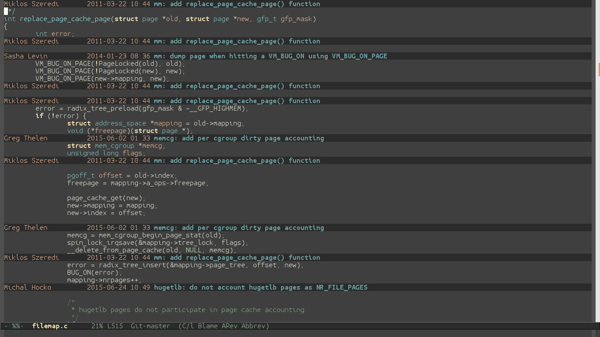

I love looking for software that makes me 'Aha!' each time I learn something is possible in the most unexpected manner.
Example:
C-u Mx-grep <pattern> in Emacs is unbelievable! You simply get hooked onto it if you usually get around to browsing source code.
I see your grep and raise you 'git grep' which is blazing fast when used from command line, the most popular git alias seems to be that for git grep -> git gg
Another great goldmine is in the oh-my-zsh package that provides an endless list of options/aliases for git users.
 However, the biggest 'Aha!' out of all these options was from the magit package in Emacs for me. I'm running the vanilla Emacs 24 from debian package I like using the zenburn theme for those who are interested. The color combo is easy on the eye and has minimal distractions for me. If you run M-x magit-status you see the usual git status output with magit's own prettification sauce. However, the magic is when you M-x magit-blame Holy God! You actually get an inline single line commit-summary for each line in the file. Basically, at this point Emacs is working in git-blame mode. If you magit-status in Emacs in general, if you are reading a file from a git repository it shows HEAD object from the git repo, however, if you run M-x magit-show-commit in magit-blame mode Emacs/Magit knows to show the commit object from the line that you are currently in. I find this useful when I am looking at relatively mature parts open source code such as the scheduler in the kernel. This part of the kernel has been actively modified by several kernel developers and is actively accepting bug fixes and minor tweaks that can provide great insights into the workings of the scheduler in Linux.

I was really happy to see this output. However, this entry goes with cavets: your experience might vary depending on the version of Emacs that you are running, the version of magit that's installed on your system. As a secondary note, each of the tools in open source world are configurable and if you have the interest and time you can end up achieving **your** perfect system by tweaking it and frankly that's what I'm accustomed to, but once in a while you run into these pleasant surprises where the default behavior alone exceeds your highest expectations. Then again, this was possible simply some developer in a different part of the world wanted this system and spent the time and effort developing system that made me go 'Aha!' Kudos to people who do this!
